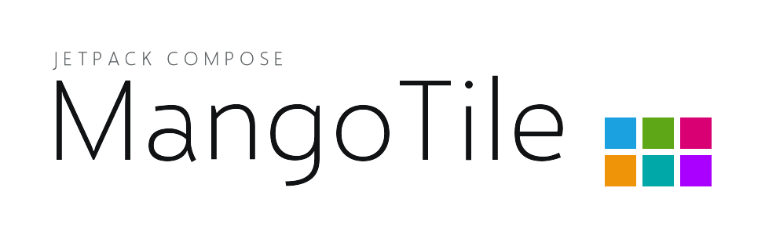
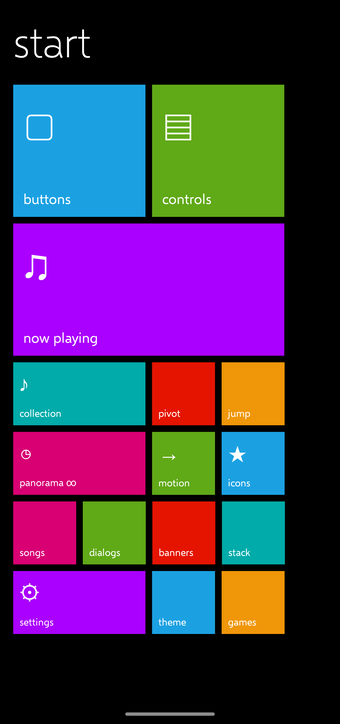
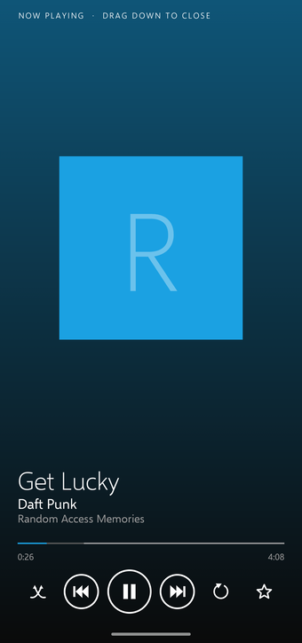
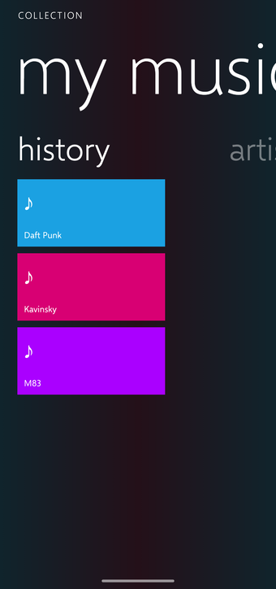

<h1>
  <picture>
    <source media="(prefers-color-scheme: dark)" srcset="docs/banner-dark.png">
    
  </picture>
</h1>

A Jetpack Compose UI kit for building Android apps that look and move like Windows Phone 8.

Not a launcher, and not a theme you paste over Material. It is a set of building blocks — tiles,
the panorama, the pivot, the long list with its jump grid, the flat typography, and the handful of
transitions that made WP8 feel like WP8 — so you can assemble a whole app in that style instead of
rebuilding the look from scratch every time.

WP8's design language still has people who miss it, and what they miss is rarely the colours — it
is the way the thing moved. That is where most of the work here went. The panorama has three real
parallax layers: background, title and content each travel at their own speed as you drag, and
letting go settles on a section boundary rather than wherever your finger stopped. Continuum
carries a title out of a list row into the next page's big header, and flows it back on Back. The
swap leaves a line **empty** for a beat before refilling it — not a cross-fade, because the empty
beat is what makes it read as words being replaced rather than blurring into each other. The
easings are measured off a Lumia doing it, not guessed at.

[](https://central.sonatype.com/artifact/io.github.diffechento/metro)

`io.github.diffechento:metro:1.0.0` · minSdk 26 · compileSdk 36 · MIT

MangoTile is the kit; `Metro` is the vocabulary of the design language it implements. So the
artifact, the package and every symbol keep that name — `MetroPanorama` means *a panorama in the
Metro style*, and renaming it to match the brand would say less, not more.

| Start | now playing | panorama ∞ |
|:---:|:---:|:---:|
|  |  |  |

All three are `:sample` on a stock emulator — tiles and `MetroPage`, a `MetroRisingPage` pulled up
out of a `MetroBottomBar`, and the circular panorama with the next header peeking in.

A panorama is about this much code:

```kotlin
MetroPanorama(title = "collection", overline = "MUSIC + VIDEOS", background = { Wallpaper() }) {
    PanoramaSection("history") {
        Tile("Daft Punk", Metro.Accent, 220.dp, 108.dp)
    }
    PanoramaSection("new") {
        Tile("Radiohead", Metro.Red, 220.dp, 108.dp)
    }
}
```

The parallax, the snap to a section boundary and the title bleeding off the right edge come with it;
there is nothing to wire up.

**[COMPONENTS.md](COMPONENTS.md) is the reference** — every page, control, panel, transition and
widget the library provides, with the reasoning behind the ones that have any.

Built with it: **[MetroMusic](https://github.com/Diffechento/MetroMusic)**, a full WP8-style music
player.

## The sample

```
./gradlew :sample:installDebug
```

`:sample` is a demo app covering the whole kit — one Start tile per area of it. Run it to see what
the library does before wiring it into anything.

- **now playing** — the shape a real player takes, and the densest screen here: a mini player in a
  `MetroBottomBar` that you pull up into a `MetroRisingPage` and push back down to dismiss, with the
  artwork swiping sideways to change track and the whole signature motion running at once —
  `metroSlideIn` on the cover, `MetroSwap` staggered down the three text lines, `MetroCrossfade` on
  the backdrop, ringed and bare `TransportButton`s, the hairline slider.
- **motion** — the same pieces separated out and keyed on one button, so the difference between a
  translation and a squeeze, and between a swap and a crossfade, is visible rather than asserted.
- **panorama ∞** — the circular, lazy list-overload panorama: a jump list living inside one section,
  settings at the far end still one swipe from the start, a switch for `backgroundTiles`.
- **collection** — the simpler lambda-overload panorama with the three-layer parallax.
- **icons** — every `MetroIcon` drawn, and typed glyphs beside `CenteredGlyph` ones.
- **banners** — `MetroTopBanner`, and a `MetroVolumeBanner` wired to the hardware volume keys.
- **jump** — the LongListSelector over Latin *and* Cyrillic, `filledGroupHeaders` on a switch.
- **stack** — `MetroBackStack`'s `push`/`pop`/`popTo`/`replaceAll`, and the per-destination state
  retention that survives a screen being covered.
- **controls**, **buttons**, **dialogs**, **pivot**, **songs**, **settings**, **theme** — the
  control gallery including `MetroSuggestBox` and `metroTilt`, the context menu with a greyed
  action, both forms of the pivot, continuum, and a theme picker that also offers a custom
  background and a `MetroBackdrop` for the whole app.

It is also the acceptance test for changes to the library: it must keep building *untouched*, which
is what keeps the promise that the API only ever grows.

```
:metro    the library — this is what ships
:sample   the demo — this is what you run
```

## Installing

On [Maven Central](https://central.sonatype.com/artifact/io.github.diffechento/metro), and
`mavenCentral()` is already in a default Android project, so this is the whole of it:

```kotlin
implementation("io.github.diffechento:metro:1.0.0")
```

Compose is exposed as `api`, so you do not re-declare the stack: the BOM, `foundation`,
`animation`, `ui`, `ui-graphics` and `material3` arrive with it.

Requirements: a recent Android Studio, minSdk 26, compileSdk 36.

Note that the artifact is `io.github.diffechento:metro` while the Kotlin package is
`com.metrocompose` — Central only issues namespaces you can prove you own, and the package name is
a separate thing from the coordinates. Imports are unaffected.

### Building it yourself

To work on the library and try the change in your own app before it is released, publish to your
local Maven repo and put `mavenLocal()` first in
`dependencyResolutionManagement.repositories`:

```
./gradlew :metro:publishToMavenLocal      # -> io.github.diffechento:metro:1.0.0
```

Republish after every change — a fixed version has no snapshot magic, so a change is invisible to
consumers until you do.

There is no test suite; verification is `:sample` plus MetroMusic running on an emulator and a
Galaxy S23.

## Licence

**MIT** — see [LICENSE](LICENSE). Build whatever you like on it, including something closed and
commercial; keep the copyright notice and you have met the terms.

The bundled Selawik fonts are not covered by that: they are Microsoft's, under the SIL Open Font
License 1.1, and keep their own terms — including a Reserved Font Name, so a subset of them may not
be called Selawik. The full text is in
[licenses/Selawik-OFL-1.1.txt](licenses/Selawik-OFL-1.1.txt), and
[THIRD-PARTY-NOTICES.md](THIRD-PARTY-NOTICES.md) has the details along with the dependencies.


MangoTile is not affiliated with Microsoft. "Windows Phone", "Metro" and "Segoe" are
Microsoft's; this is an homage to a design language, built from scratch.
